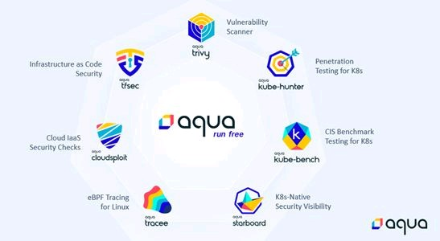

# Aqua Security Open Source Tools

## Requirements

- Docker - [doc](https://docs.docker.com/get-started/)
- Minikube or another kubernetes cluster - [doc](https://minikube.sigs.k8s.io/docs/start/)
- Kubectl - [doc](https://kubernetes.io/es/docs/tasks/tools/install-kubectl/)
- Krew - [doc](https://krew.sigs.k8s.io/)

## Tools

1. Kube-hunter (Kubernetes penetration test tool) - [demo](https://github.com/glidercode/aquasecurity/blob/main/kube_hunter.md) - [doc](https://github.com/aquasecurity/kube-hunter)
2. Kube-bench (CIS Kubernetes Benchmark tool - [demo](https://github.com/glidercode/aquasecurity/blob/main/kube_bench.md) - [doc](https://github.com/aquasecurity/kube-bench)
3. Trivy (Vulnerability Scanner for Containers) - [demo](https://github.com/glidercode/aquasecurity/blob/main/trivy.md) - [doc](https://github.com/aquasecurity/trivy)
4. Tracee (Container and system tracing using eBPF) - [demo](https://github.com/glidercode/aquasecurity/blob/main/tracee.md) - [doc](https://github.com/aquasecurity/tracee)
5. Starboard (Kubernetes-native security tool kit) - [demo](https://github.com/glidercode/aquasecurity/blob/main/starboard.md) - [doc](https://github.com/aquasecurity/starboard)
6. Tfsec (Infrastructure as Code Security) - [doc](https://github.com/aquasecurity/tfsec)
7. Cloudsploit (Cloud IaaS Security Checks) - [doc](https://github.com/aquasecurity/cloudsploit)
